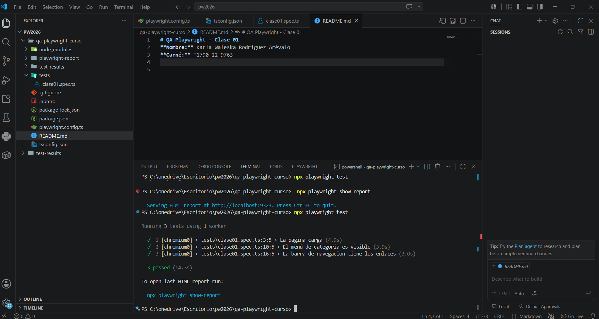
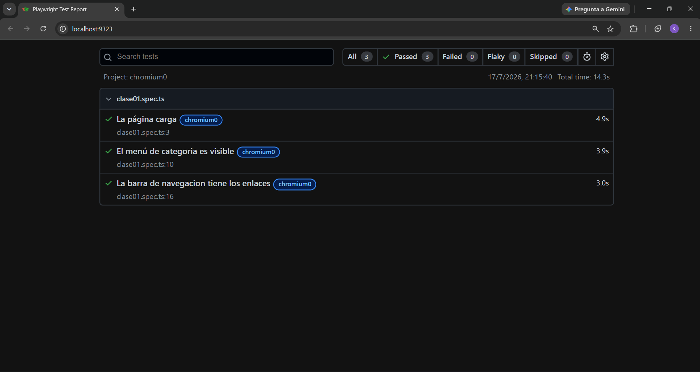

# QA Playwright - Clase 01
**Nombre:** Karla Waleska Rodríguez Arévalo
**Carné:** T1790-22-9763


## Versión de Node.js

Versión utilizada:

```text
v22.17.1
```
## Evidencia de ejecución>> 

### Captura de la ejecución


### Reporte de Playwright




# Práctica Clase 02 - Playwright

## Evidencias
Las capturas de pantalla generadas por las pruebas se encuentran en la carpeta `evidencias/`.

## Reflexión: Auto-wait vs. sleep()

Playwright utiliza una característica llamada **auto-wait**, la cual espera automáticamente a que los elementos de la página estén listos antes de interactuar con ellos. Gracias a esto, las pruebas son más estables, rápidas y confiables, ya que no es necesario indicar tiempos de espera fijos.

  `sleep()` o `waitForTimeout()` obliga al programa a detener su ejecución durante un tiempo determinado, aunque el elemento ya esté disponible. Esto hace que las pruebas sean más lentas y aumenta la posibilidad de fallos si el tiempo de espera es insuficiente o excesivo.
